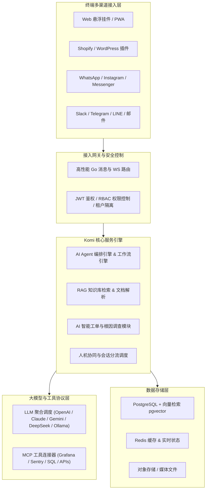

<div align="center">

# 🤖 Komi AI

### 面向跨境电商与现代企业的开源 AI 智能客服与智能体平台

<p align="center">
  <b>融合大模型、可视化 Agent 工作流、企业级 RAG 知识库与多渠道统一收件箱的下一代客户沟通中台</b>
</p>

<p align="center">
  <a href="https://opensource.org/licenses/Apache-2.0"></a>
  <a href="https://vuejs.org/"></a>
  <a href="https://fastapi.tiangolo.com/"></a>
  <a href="https://www.postgresql.org/"></a>
  <a href="https://modelcontextprotocol.io/"></a>
  
</p>

> 💡 **【商业合作 & 定制开发】**  
> 承接 **AI 智能客服系统**、**AI Agent 智能体工作流定制**、**跨境电商/独立站出海方案** 以及 **各类企业级 Web/全栈/移动端软件定制开发**。  
> 💬 **微信联系**：`soe303`（添加请备注：项目咨询/软件定制）

<p align="center">
  <a href="#-核心特性">核心特性</a> •
  <a href="#-系统架构">系统架构</a> •
  <a href="#-多渠道生态">多渠道生态</a> •
  <a href="#-快速开始">快速开始</a> •
  <a href="#-安全与隐私保护">安全与隐私</a> •
  <a href="#-方案对比">方案对比</a>
</p>

---

</div>

## 📖 项目简介

**Komi AI** 是一套专为**跨境电商独立站、SaaS 软件及现代数字化企业**打造的高性能开源 AI 智能客服与自动化沟通平台。

平台深度融合了现代大语言模型（LLM）与智能体工作流（AI Agent Workflow），支持在 **Shopify、WordPress、独立站网站、WhatsApp、Instagram、Facebook Messenger、Telegram、Slack、邮件** 等多渠道中提供 7×24 小时的智能问答、意图识别、自动化订单/物流追踪与智能人机协作转接。

作为 **Intercom、Zendesk、Crisp 与 Chatbase** 的高自由度开源私有化替代方案，Komi AI 确保企业在享受前沿 AI 能力的同时，拥有 **100% 的数据自主权与本地安全可控性**。

---

## ✨ 核心特性

### 🤖 1. 全主流大模型与私有化模型支持 (Multi-Model AI)
- **自由切换模型底座**：原生接入 **OpenAI (GPT-4o/o1/o3)、Anthropic Claude 3.5、Google Gemini 1.5/2.0、DeepSeek (V3/R1)、Mistral、xAI Grok、Groq**。
- **支持自定义与本地模型**：兼容 OpenAI API 标准格式的本地 Ollama / vLLM 私有化大模型部署，企业无需锁定单一供应商。

### 🛍️ 2. 电商与独立站原生赋能 (E-commerce Automation)
- **Shopify 原生插件与 API 直连**：实时拉取店铺商品、库存、订单履约状态及物流轨迹，实现自动化催付、退换货指引与物流查询。
- **多平台挂件一键集成**：提供轻量级 Web Widget 悬浮挂件与 WordPress 插件，一行代码即可嵌入任意网站。

### 🧩 3. 可视化 AI Agent 工作流编排器 (Workflow Builder)
- **低代码拖拽式画布**：支持自由编排多轮对话流，包含 **LLM 意图判断、条件分支路由、人机转接节点、结构化表单收集、API 触发器**。
- **版本控制与实时沙盒调试**：支持工作流多版本保存、回滚以及在发布前进行全流程可视化即时测试。

### 📚 4. 企业级 RAG 向量知识库 (Knowledge Base)
- **多源数据混合导入**：支持一键爬取整站文档 URL，批量解析 **PDF、Word、Markdown、Excel、TXT** 等格式文件。
- **高精度召回与幻觉抑制**：采用分块重排（Re-ranking）与向量混合检索技术，精准输出带溯源引用的专业回答。

### 🤝 5. 智能人机无缝协同 (Smart Human Handoff)
- **营业时间与在线状态感知**：AI 根据客服在线状态智能路由，复杂诉求或高意向客户自动无缝升级至人工坐席。
- **坐席统一协作工作台**：人工坐席可实时查看客户完整上下文、AI 生成的摘要总结，并获得 AI 一键辅助拟答。

### 🎫 6. 自动化 AI 工单调查与根因分析 (AI Ticketing & Root-Cause)
- **AI 自主排查**：工单生成后，AI Agent 自动调取日志、监控数据与业务数据库进行假设验证，生成带证据链的排查报告（Root-Cause Analysis）。
- **只读安全 SQL 围栏**：内置 AST 语法树解析器，确保 AI 仅能执行受严格白名单与客户行级隔离保护的只读查询。

### 🧰 7. 原生 Model Context Protocol (MCP) 支持
- 支持作为 MCP 客户端/服务端接入 **Grafana、Elasticsearch、Sentry、CloudWatch** 等企业内部监控与数据工具链。

---

## 🌐 多渠道生态 (Omnichannel Inbox)

通过统一后台集中管理所有用户触点，对话状态与 AI 策略全渠道实时同步：

| 渠道分类 | 支持平台 | 说明 |
| :--- | :--- | :--- |
| **独立站与 Web** | 🌐 **Web Chat Widget**、🛍️ **Shopify**、📝 **WordPress** | 极速加载，全自定义 UI 主题与品牌风格 |
| **海外主流社媒** | 💬 **WhatsApp Cloud API**、📷 **Instagram DM**、💬 **Messenger** | 官方 Meta 商业套件接入，支持富媒体与模板消息 |
| **办公与即时通讯** | 🔷 **Slack**、✈️ **Telegram**、🟢 **LINE** | 团队内部技术支持或海外用户社群沟通 |
| **传统通讯** | 📧 **Email (邮件工单)**、📱 **SMS (Twilio/Vonage/Plivo)** | 邮件往来自动转为会话，短信自动化通知 |
| **CRM 客户管理** | 🟠 **HubSpot**、🟩 **Pipedrive** | 自动将对话捕获的高意向商机同步至销售 CRM |

---

## 🏗️ 系统架构



---

## 🚀 快速开始

### 方式一：Docker 一键极速部署（推荐）

Komi AI 提供了开箱即用的 Docker Compose 编排文件：

```bash
# 1. 克隆代码仓库
git clone https://github.com/15673312611/Komi-AI.git
cd Komi-AI

# 2. 配置环境变量（从安全模板复制，按需配置密钥）
cp backend/.env.example backend/.env
cp frontend/.env.example frontend/.env

# 3. 启动全栈服务（包含前端、后端、Go网关与数据库）
docker compose up -d
```

启动完成后，在浏览器中访问：
- **控制台看板**：`http://localhost:3000`
- **后端 API 文档**：`http://localhost:8000/docs`

---

### 方式二：本地源码开发调试

#### 1. 前端环境构建
```bash
cd frontend
npm install
npm run dev
```

#### 2. Python 后端服务构建
```bash
cd backend
python -m venv venv
# Windows: venv\Scripts\activate | Linux/macOS: source venv/bin/activate
pip install -r requirements.txt

# 初始化数据库结构迁移
alembic upgrade head

# 启动后端 API 服务
uvicorn app.main:app --host 0.0.0.0 --port 8000 --reload
```

#### 3. Go 高性能服务端（可选）
```bash
cd backend-go
go run main.go
```

---

## 🔒 安全与隐私保护 (Security & Privacy)

Komi AI 将数据安全与合规放在首位，专为企业级私有化生产环境设计：

1. **核心机密与配置隔离**：所有 API 密钥、数据库连接串、JWT 密钥均采用环境变量形式管理，严禁硬编码，代码仓库中仅保留安全模版。
2. **只读 SQL 深度安全围栏**：
   - 强制只读 AST 语法树检测，杜绝任何 `INSERT/UPDATE/DELETE/DROP` 及批处理注入风险。
   - 强制行级租户隔离（Row-Level Scoping），防止跨客户数据越权访问。
3. **敏感信息动态脱敏**：对话与导出日志中的邮箱、手机号、支付信息均支持可配置的动态掩码。
4. **全链路加密**：静态存储支持 Fernet 算法加密，传输链路全量强制 TLS/WSS 加密。

---

## 📊 方案对比

| 功能特性 | **Komi AI (本项目)** | **Intercom / Zendesk** | **传统开源客服系统** |
| :--- | :---: | :---: | :---: |
| **部署方式** | 🟢 **100% 私有化自托管 / 云原生** | 🔴 仅 SaaS (数据上公有云) | 🟡 部分支持 |
| **数据所有权** | 🟢 **企业完全自主掌控** | 🔴 平台集中托管 | 🟢 自主掌控 |
| **大模型选择** | 🟢 **自由切换 (DeepSeek/GPT/Claude/Ollama)** | 🔴 厂商封闭绑定 | 🟡 仅支持单一模型 |
| **电商/Shopify 深度整合** | 🟢 **原生支持订单/物流/商品** | 🟡 需昂贵三方插件 | 🔴 无 |
| **多渠道统一接入 (WhatsApp/Meta)** | 🟢 **原生全部集成** | 🟡 需额外加购按席位收费 | 🔴 仅网页端 |
| **AI 智能工单调查分析** | 🟢 **自带 AST 围栏与证据溯源** | 🔴 仅基础派单规则 | 🔴 无 |
| **成本预算** | 🟢 **完全开源免费，仅消耗 Token 成本** | 🔴 极高 (每月每席位数百美元) | 🟢 免费 |

---

## 🛠️ 技术栈一览

- **前端架构**：`Vue 3` + `TypeScript` + `Vite` + `TailwindCSS` + `Pinia` + `PWA`
- **后端架构**：`Python 3.11+` + `FastAPI` + `SQLAlchemy 2.0` + `Celery / Redis`
- **高性能服务**：`Golang (Gin / Gorilla WebSocket)`
- **数据与检索**：`PostgreSQL 15+` + `pgvector` + `Redis`
- **协议与集成**：`Model Context Protocol (MCP)` + `OAuth 2.0` + `Meta Graph API` + `Shopify Storefront API`

---

## 🗺️ 发展路线 (Roadmap)

- [x] 多主流大模型统一调度与切换 (OpenAI, Claude, Gemini, DeepSeek)
- [x] 可视化 AI Agent 工作流与条件分支引擎
- [x] Shopify / WordPress / Web 挂件原生适配
- [x] WhatsApp / Instagram / Messenger 多渠道收件箱
- [x] 基于 MCP 的安全数据库与监控工具调用
- [ ] 语音通话与实时多模态 Agent 交互支持
- [ ] 更多跨境电商独立站平台（WooCommerce、Shoplazza 等）一键适配
- [ ] 本地模型微调与量化评估工作台

---

## 🤝 商业定制与技术支持

如果您有以下需求，欢迎随时联系沟通：
- 🛠️ **企业级私有化定制部署与二次开发**
- 🛍️ **电商独立站（Shopify / WooCommerce 等）全自动 AI 客服对接**
- 🤖 **专属行业大模型知识库（RAG）构建与 Agent 工作流编排**
- 💻 **各类 Web / 小程序 / 全栈 / 自动化软件定制开发**

> 📲 **微信联系**：`soe303`  
> 📌 **添加请备注**：`Komi定制` 或 `软件开发`

---

## 📄 开源许可证

本项目采用 [Apache-2.0 开源许可证](LICENSE)。
